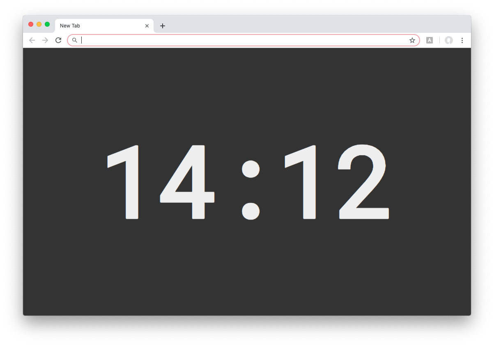
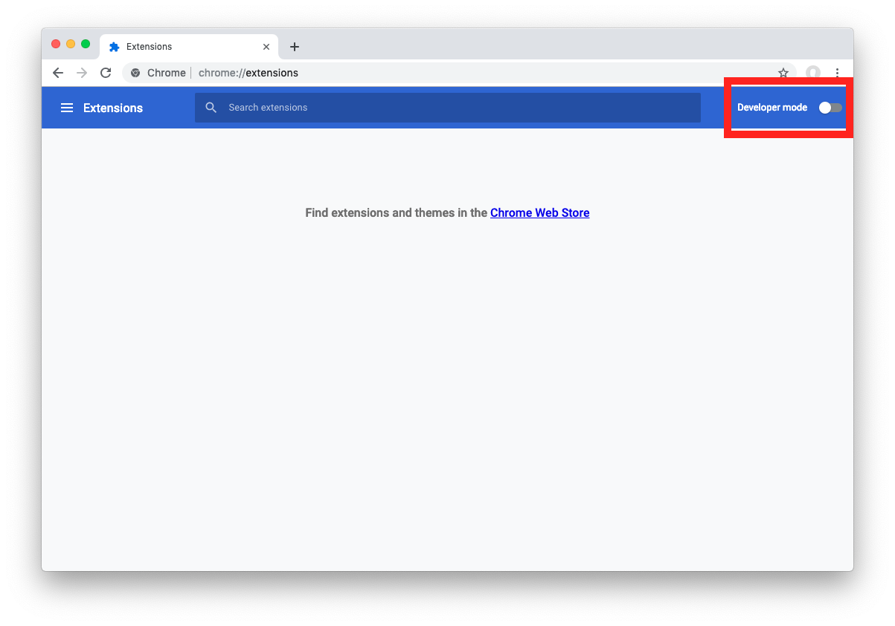
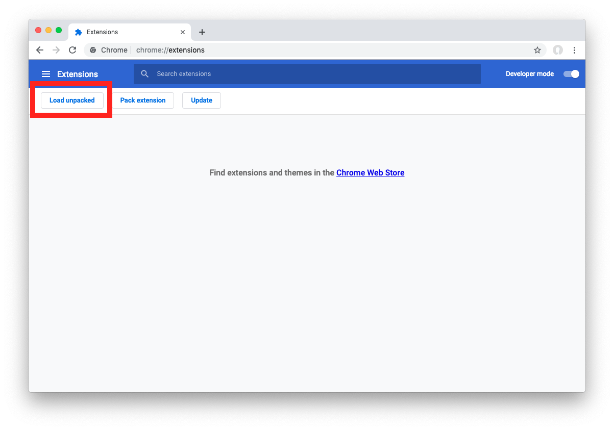

# Another new tab

This extension shows the time, and you can change the colors.

That's it.

## Installation

Load this extension unpacked.

### Detailed instructions
1. Download this repo

1. Go to `chrome://extensions`

1. Endable developer mode

    

1. Load unpacked and open the folder

    
